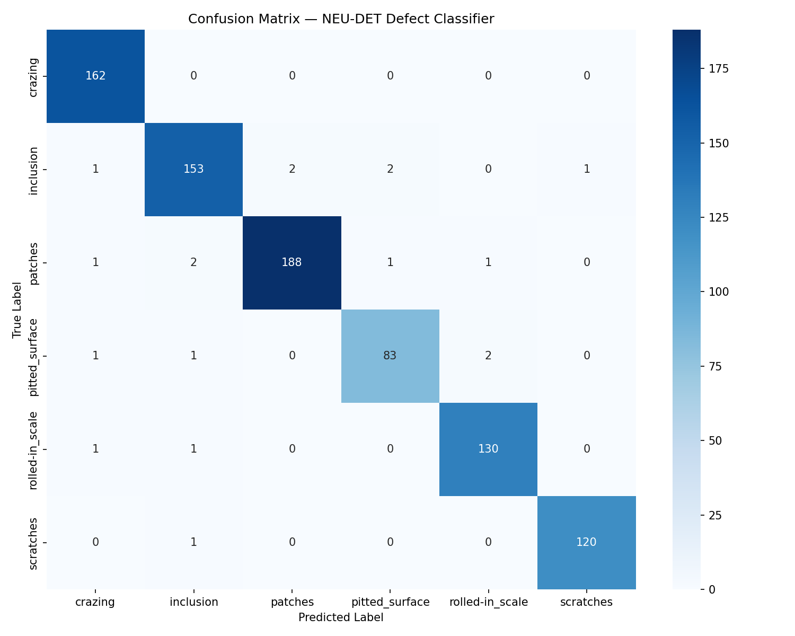
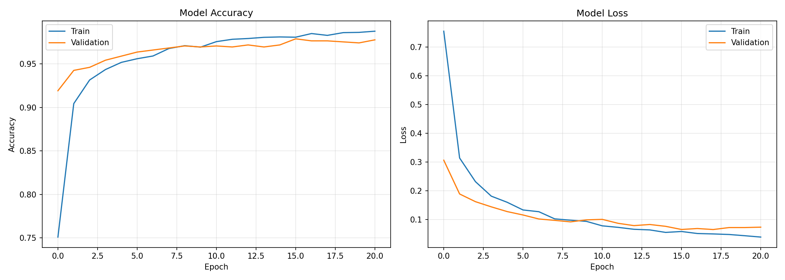

# Automated Surface Defect Detection System

## Overview
A deep learning system for automated detection and classification of surface defects in steel manufacturing. The model localises defect regions using a sliding window approach and classifies them into one of six defect types using a MobileNetV2 backbone trained via transfer learning on the NEU Metal Surface Defects Database.

**Key Results:**

| Metric | Value |
|---|---|
| Validation Accuracy | 97.89% |
| Macro F1-Score | 0.98 |
| Validation Loss | 0.0874 |
| Training Samples | 3,332 (6,664 after augmentation) |
| Validation Samples | 854 |

**Tech Stack:** Python · TensorFlow / Keras · MobileNetV2 · OpenCV · Scikit-Learn

---

## Defect Classes
The model classifies six real-world steel surface defect types from the NEU-DET dataset:

| Class | F1-Score | Support |
|---|---|---|
| Crazing | 0.99 | 162 |
| Inclusion | 0.97 | 159 |
| Patches | 0.98 | 193 |
| Pitted Surface | 0.96 | 87 |
| Rolled-in Scale | 0.98 | 132 |
| Scratches | 0.99 | 121 |

---

## Architecture

### Model
- **Backbone:** MobileNetV2 pretrained on ImageNet (frozen during Phase 1)
- **Head:** GlobalAveragePooling → BatchNorm → Dense(256) → Dropout(0.4) → Dense(128) → Dropout(0.3) → Softmax(6)
- **Total parameters:** 2,624,710 | **Trainable (Phase 1):** 364,166

### Training Strategy
Two-phase transfer learning:
- **Phase 1:** Train classification head only (backbone frozen), 21 epochs, early stopping at epoch 21, best val_accuracy: 97.89%
- **Phase 2:** Fine-tune top 30 layers of MobileNetV2 at 10× lower learning rate, 15 epochs, best val_accuracy: 97.89%

### Detection
At inference time, `scan_part.py` runs a multi-scale sliding window over the input image. Each window crop is classified by the model. Non-Maximum Suppression (NMS) removes overlapping detections, and results are drawn as colour-coded bounding boxes with confidence scores.

---

## Dataset
**NEU Metal Surface Defects Database (NEU-DET)**
- Source: [Kaggle](https://www.kaggle.com/datasets/kaustubhdikshit/neu-surface-defect-database)
- 1,800 grayscale images (200×200px), 300 per defect class
- VOC-format XML bounding box annotations
- Split: 1,439 training images / 361 validation images

> The dataset is not included in this repository. Download it from Kaggle and place the `NEU-DET/` folder in the project root before training.

---

## Usage

**1. Install dependencies:**
```bash
pip install -r requirements.txt
```

**2. Download the dataset** from [Kaggle](https://www.kaggle.com/datasets/kaustubhdikshit/neu-surface-defect-database) and place `NEU-DET/` in the project root.

**3. Train the model:**
```bash
python train_inspector.py
```
Outputs: `defect_inspector.keras`, `label_encoder.pkl`, `confusion_matrix.png`, `training_history.png`

**4. Run inference on an image:**
```bash
python scan_part.py NEU-DET/validation/images/crazing/crazing_1.jpg
```

---

## Results

### Confusion Matrix


### Training History


---

## Limitations
- Sliding window inference is slow (~5–15 seconds per image on CPU). A proper object detection model (e.g. YOLOv8) would be faster but requires significantly more compute to train.
- The model is trained on NEU-DET steel surface images. Performance on other materials or imaging conditions may vary without retraining.
- `pitted_surface` has the lowest F1 (0.96) and smallest support (87 samples), the least represented class in the dataset.